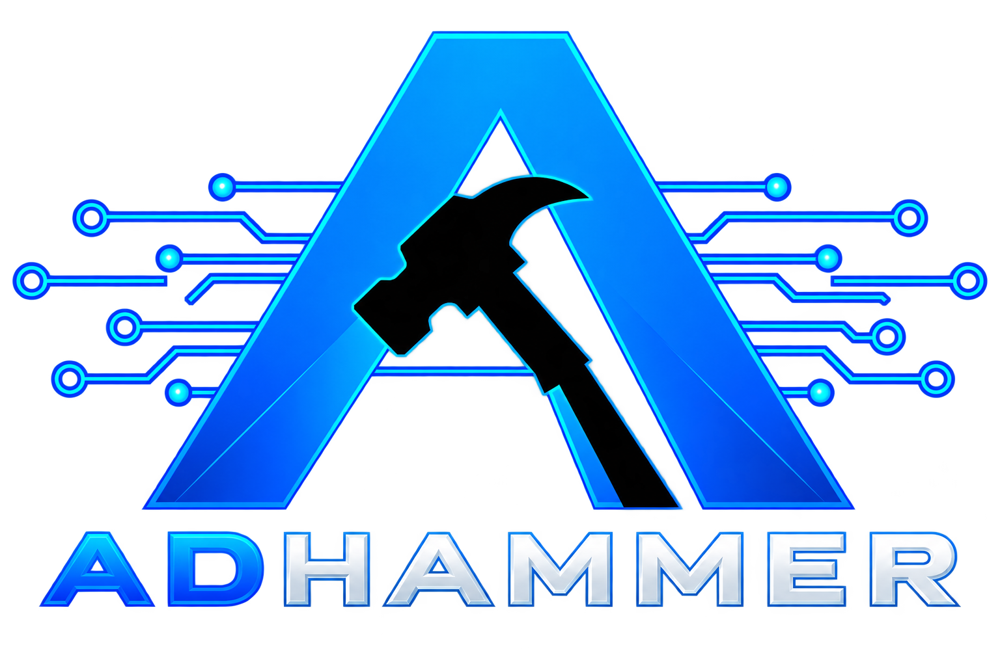

<div align="center">
  

  <h1>Security Research &amp; Open-Source Tooling</h1>

  <p><b>Active Directory · Windows authentication · Pure Rust protocols</b></p>
</div>

---

```text
Building evidence-first security tools for authorized Active Directory assessment.
Researching Windows authentication and implementing transparent protocol foundations.
Focused on reproducible results, safe parsing, and open-source engineering.
```

---

<h2 align="center">Projects</h2>

<p align="center">
  <a href="https://github.com/icedracon/adhammer"></a>
  <a href="https://icedracon.github.io/adhammer/"></a>
  <a href="https://github.com/icedracon?tab=repositories"></a>
</p>

<h2 align="center">Programming Languages</h2>

<p align="center">
  
  
  
  
</p>

<h2 align="center">Security Operations</h2>

<p align="center">
  
  
  
  
  
  
  
  
  
</p>

<h2 align="center">Windows &amp; Identity Protocols</h2>

<p align="center">
  
  
  
  
  
  
  
  
  
  
</p>

<h2 align="center">Engineering Focus</h2>

<p align="center">
  
  
  
  
</p>

<h2 align="center">Featured Open Source</h2>

<p align="center">
  <a href="https://github.com/icedracon/adhammer"></a>
  <a href="https://github.com/icedracon/dcerpc"></a>
  <a href="https://github.com/icedracon/ntlmssp"></a>
  <a href="https://github.com/icedracon/ms-ndr"></a>
</p>

---

<p align="center">
  <sub>For authorized security assessment, reproducible research, and transparent validation.</sub>
</p>
