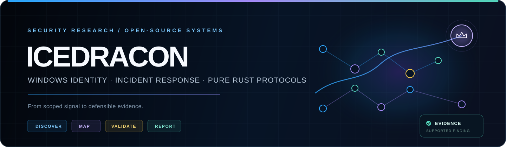

<p align="center">
  
</p>

<p align="center">
  <a href="https://github.com/icedracon/adhammer"></a>
  <a href="https://github.com/icedracon/adhammer/releases/latest"></a>
  <a href="https://icedracon.github.io/adhammer/"></a>
</p>

I build **evidence-first security tools** for Windows identity, incident response,
and authorized assessment — mostly in Rust. The work is designed to be
inspectable: collect scoped signals, model the path, validate what is supported,
and keep the evidence connected to the conclusion.

```text
signal  ──▶  scoped collection  ──▶  control path  ──▶  supported finding  ──▶  report
```

## Flagship: ADhammer

[**ADhammer**](https://github.com/icedracon/adhammer) is an Active Directory
security assessment platform built around a simple rule: **evidence, not
assumptions**.

- Discover directory objects, policy, delegation, and trust relationships.
- Map Tier-0 control paths and explain why each edge matters.
- Validate findings only when the collected evidence supports them.
- Produce human-readable reports without separating proof from impact.

**Explore:** [project site](https://icedracon.github.io/adhammer/) ·
[source](https://github.com/icedracon/adhammer) ·
[latest release](https://github.com/icedracon/adhammer/releases/latest) ·
[SDK docs](https://docs.rs/adhammer-sdk)

## Open-source systems

| Layer | Projects | Purpose |
|---|---|---|
| **Identity & crypto** | [`kerbcore`](https://github.com/icedracon/kerbcore) · [`ntlmssp`](https://github.com/icedracon/ntlmssp) · [`dpapi-ng`](https://github.com/icedracon/dpapi-ng) | Kerberos, NTLMSSP, and Windows protected-data foundations in pure Rust |
| **Wire & RPC** | [`smb2-client`](https://github.com/icedracon/smb2-client) · [`dcerpc`](https://github.com/icedracon/dcerpc) · [`ms-ndr`](https://github.com/icedracon/ms-ndr) | Authenticated transport, Microsoft RPC, and bounded data representation |
| **Windows evidence** | [`windows-eventlog-native`](https://github.com/icedracon/windows-eventlog-native) · [`windows-sddl`](https://github.com/icedracon/windows-sddl) · [`ad-access`](https://github.com/icedracon/ad-access) | Event collection, security descriptors, and effective-access analysis |
| **Native foundation** | [`win32-min`](https://github.com/icedracon/win32-min) | Focused Win32 interfaces with explicit safety contracts and ABI verification |

The libraries are intentionally small and composable. Together they form the
protocol and evidence pipeline beneath higher-level assessment and defensive
workflows.

## Security practice

| Discipline | What I optimize for |
|---|---|
| **SOC & incident response** | Fast triage, defensible context, and useful handoff |
| **Malware analysis** | Behavior-led investigation and concise reporting |
| **Active Directory security** | Identity relationships, privilege paths, and supported validation |
| **Android / APK security** | Explicitly scoped static and dynamic assessment |

## Selected build outside security

[**ECHO**](https://github.com/icedracon/ECHO) is a private-by-design,
cross-platform pixel-art desktop companion. It reacts to local activity,
remembers between sessions, and runs without accounts or runtime telemetry.
It is where I explore product design, animation systems, and local-first software.

## Engineering principles

- **Scope first.** Security work begins with explicit authorization and visible boundaries.
- **Observed is not proved.** Collection, inference, and validation stay separate.
- **Small foundations.** Protocol components remain focused, testable, and reusable.
- **Useful evidence.** Results should help both the operator and the defender make a decision.

<details>
<summary><strong>Research map</strong></summary>
<br />

`Active Directory` · `Kerberos` · `NTLMSSP` · `LDAP` · `SMB2` · `DCE/RPC` ·
`NDR` · `DPAPI-NG` · `Windows Event Log` · `security descriptors` ·
`SOC / IR` · `malware analysis` · `Android / APK security` · `Rust`

</details>

---

<p align="center">
  <strong>Authorized research. Reproducible evidence. Transparent tooling.</strong><br />
  <a href="https://github.com/icedracon?tab=repositories">Explore all repositories</a>
</p>
