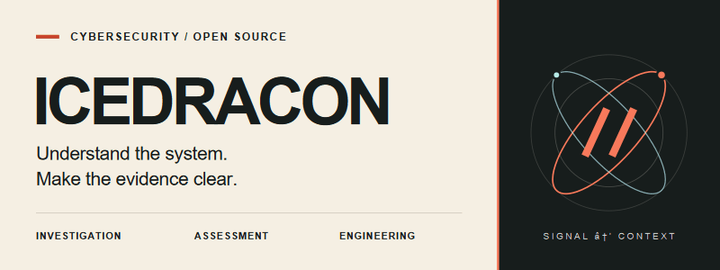

  

<a href="assets/profile-banner.svg">Static banner</a>

  <a href="https://icedracon.github.io/adhammer/"><strong>ADhammer website ↗</strong></a>
  &nbsp; · &nbsp;
  <a href="https://github.com/icedracon?tab=repositories">Repositories</a>
  &nbsp; · &nbsp;
  <a href="https://docs.rs/adhammer-sdk">Rust SDK</a>

## Security work. Explainable results.

I'm **icedracon**, a cybersecurity specialist and open-source developer.
My focus spans SOC and incident response, malware analysis, and authorized
Active Directory, web, and Android / APK pentesting.

I build mostly in **Rust**, with a particular interest in Windows identity,
protocol engineering, and evidence that another person can inspect.

### 01 / Security practice

| Focus | What matters to me |
|:--|:--|
| **SOC & incident response** | SIEM investigations, log and traffic analysis, EDR / DLP context, and clear incident handoffs. |
| **Malware & detection** | Understanding behavior, documenting findings, and working with Sigma and YARA detection concepts. |
| **Active Directory pentesting** | Identity relationships, directory posture, privilege paths, and evidence-backed conclusions within authorized scope. |
| **Web & Android / APK pentesting** | Scoped application assessment, static and dynamic analysis, and actionable reporting. |

These are my practice areas—not a claim that every project below implements them.

### 02 / Featured work

#### ADhammer
**Active Directory assessment, built around evidence.**

An open-source Rust CLI for directory assessment, Tier-0 path analysis, and
structured reporting. A possible path is not proof: capability support and
outstanding validation are recorded in the
[validation ledger](https://github.com/icedracon/adhammer/blob/main/docs/VALIDATION.md).

[Explore the experience ↗](https://icedracon.github.io/adhammer/) ·
[Read the source](https://github.com/icedracon/adhammer) ·
[Releases](https://github.com/icedracon/adhammer/releases) ·
[crates.io](https://crates.io/crates/adhammer)

#### Protocols & Windows foundations

Small building blocks for larger systems. Each project has its own scope,
documentation, and validation status.

| Area | Selected repositories |
|:--|:--|
| **Identity & cryptography** | [kerbcore](https://github.com/icedracon/kerbcore) · [ntlmssp](https://github.com/icedracon/ntlmssp) · [dpapi-ng](https://github.com/icedracon/dpapi-ng) |
| **Transport & representation** | [smb2-client](https://github.com/icedracon/smb2-client) · [dcerpc](https://github.com/icedracon/dcerpc) · [ms-ndr](https://github.com/icedracon/ms-ndr) |
| **Windows evidence & access** | [windows-eventlog-native](https://github.com/icedracon/windows-eventlog-native) · [windows-sddl](https://github.com/icedracon/windows-sddl) · [ad-access](https://github.com/icedracon/ad-access) |
| **Native interfaces** | [win32-min](https://github.com/icedracon/win32-min) |

#### A different side: ECHO
A pixel-art desktop companion and a place to explore product design,
animation, and local-first software.
[Meet ECHO ↗](https://github.com/icedracon/ECHO)

### 03 / How I work

**Scope before action.** Explicit authorization and clear boundaries.

**Evidence before conclusions.** Observation, inference, and proof stay distinct.

**Clarity before noise.** Focused tools, readable reports, and reusable components.

---

  CYBERSECURITY &nbsp; / &nbsp; OPEN SOURCE &nbsp; / &nbsp; BUILT WITH INTENT

