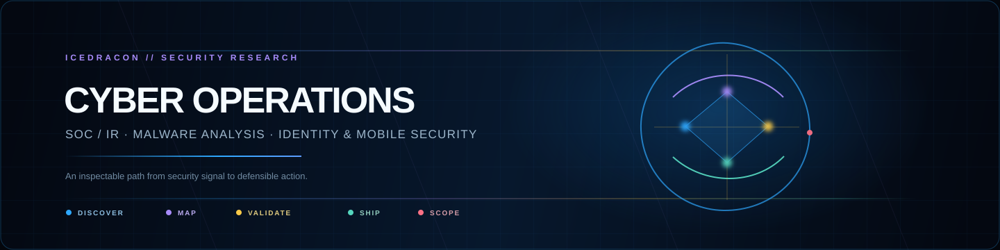

  

<h1 align="center">icedracon</h1>

  <strong>Security research for Windows identity.</strong> 
  Evidence-first Active Directory assessment · Windows authentication research · transparent Rust protocol tooling

  
  
  

## What I build

I build evidence-first security tools for authorized Active Directory assessment.
I research Windows authentication and create small, inspectable Rust protocol
foundations with reproducible results and safe parsing.

  
  
  
  

## Selected work

- [**ADhammer**](https://github.com/icedracon/adhammer) — evidence-first Active
  Directory assessment: collect scoped signal, map Tier-0 control paths, and
  keep supported proof connected to the report. [Project site](https://icedracon.github.io/adhammer/) · [Latest release](https://github.com/icedracon/adhammer/releases)
- [**dcerpc**](https://github.com/icedracon/dcerpc) — Rust DCE/RPC protocol work.
- [**ntlmssp**](https://github.com/icedracon/ntlmssp) — NTLMSSP / NTLMv2 protocol work.
- [**ms-ndr**](https://github.com/icedracon/ms-ndr) — safe NDR parsing work.

## Research areas

<strong>Open the research map</strong>

 

- **Windows identity** — Active Directory, Kerberos, NTLMSSP, LDAP, SMB,
  DCE/RPC, NDR, DPAPI-NG, WinRM, and CredSSP.
- **Defensive evidence** — SIEM-oriented handoff, monitoring, log analysis,
  incident reporting, and transparent validation.
- **Adjacent defensive research** — Sigma/YARA detection work plus EDR and DLP
  awareness. These are external controls, not claims about a single tool.
- **Assessment boundaries** — Active Directory assessment is the native focus;
  web and Android / APK testing are separate, explicitly scoped disciplines.
- **Engineering** — pure Rust protocol implementation, authentication protocol
  work, safe binary parsing, and reproducible open-source tooling.

## Working principles

- Make the scope visible before an assessment starts.
- Treat an observed condition and a proved condition as different things.
- Build tools that are inspectable, reproducible, and useful to defenders.

  

Security research and assessment work is for systems I own or am explicitly
authorized to test. The goal is transparent validation and stronger defensive
decisions.
