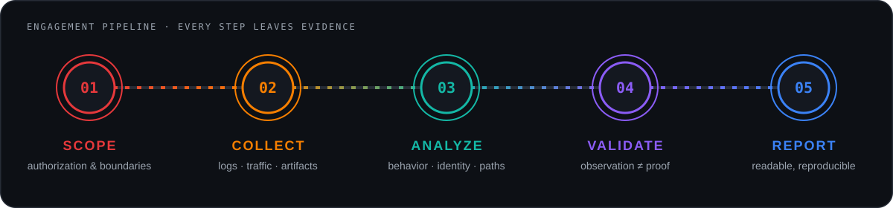
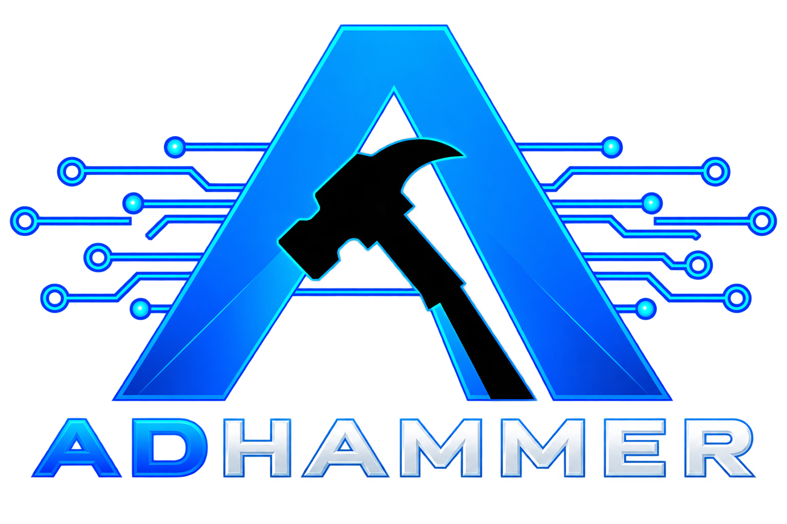

  

  
  
  
  

I'm **icedracon**, a cybersecurity specialist and open-source developer.
I work across **SOC and incident response**, **malware analysis**, and
**authorized security assessment** (Active Directory, web, and Android).

I build mostly in **Rust**. I'm especially interested in Windows identity,
protocol engineering, and producing evidence that someone else can check.

$\color{#e5383b}{\textsf{SOC / IR}} \quad \color{#f77f00}{\textsf{Malware}} \quad \color{#14b8a6}{\textsf{Identity}} \quad \color{#8b5cf6}{\textsf{AppSec}} \quad \color{#3b82f6}{\textsf{Rust}}$

These are my practice areas. Not every project below implements all of them.

<table>
  <tr>
    <td width="32%" align="center">
      
    </td>
    <td>
      <h3>ADhammer</h3>
      
<strong>Active Directory assessment, built around evidence.</strong>

      
Open-source Rust CLI for directory assessment and structured reporting.
      A possible finding is not proof: capability support and open validation work are tracked in the
      <a href="https://github.com/icedracon/adhammer/blob/main/docs/VALIDATION.md">validation ledger</a>.

      

        <a href="https://icedracon.github.io/adhammer/">Website</a> ·
        <a href="https://github.com/icedracon/adhammer">Source</a> ·
        <a href="https://github.com/icedracon/adhammer/releases">Releases</a> ·
        <a href="https://crates.io/crates/adhammer">crates.io</a>
      

    </td>
  </tr>
</table>

| Area | Repositories |
|:--|:--|
| 🟢 **Identity & cryptography** | [kerbcore](https://github.com/icedracon/kerbcore) · [ntlmssp](https://github.com/icedracon/ntlmssp) · [dpapi-ng](https://github.com/icedracon/dpapi-ng) |
| 🟠 **Transport & encoding** | [smb2-client](https://github.com/icedracon/smb2-client) · [dcerpc](https://github.com/icedracon/dcerpc) · [ms-ndr](https://github.com/icedracon/ms-ndr) |
| 🟣 **Windows evidence & access** | [windows-eventlog-native](https://github.com/icedracon/windows-eventlog-native) · [windows-sddl](https://github.com/icedracon/windows-sddl) · [ad-access](https://github.com/icedracon/ad-access) |
| 🔵 **Native interfaces** | [win32-min](https://github.com/icedracon/win32-min) |

**[ECHO](https://github.com/icedracon/ECHO)**: a pixel-art desktop companion. It's where I explore product design, animation, and local-first software.

> [!IMPORTANT]
> **Scope before action.** Explicit authorization and clear boundaries.

> [!TIP]
> **Evidence before conclusions.** Observation, inference, and proof stay separate.

> [!NOTE]
> **Clarity before noise.** Focused tools, readable reports, reusable components.

---

  CYBERSECURITY &nbsp;/&nbsp; OPEN SOURCE &nbsp;/&nbsp; BUILT WITH INTENT

